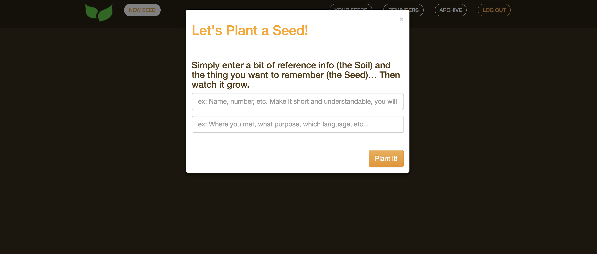

# 
# Plant The Seed 

The Ultimate Memory Learning Tool - now you can commit anything from short term to long term memory with the scientifically proven methods of repetition and retention. The App will allow you to create flash cards and send you notifications in a very  specific amount of time to make it as a game giving you feeling that you are growing up a flower from a seed to a blossom.

#### *Check it out on Heroku* :  https://planttheseed.herokuapp.com/

## Technologies used:
* React
* Socket.io
* JavaScript
* Node.js
* Express
* Seguelize
* Bootstrap


## Instructions:

### To run locally:
* create a .env.local file in the root directory similar to below, but with your database info:
```
DB_HOST=127.0.0.1
DB_USERNAME=root
DB_PASSWORD=ChangeMe123
DB_SCHEMA=example_db
DB_DIALECT=mysql
```
* run schema.sql simply to create the schema in mysql workbench/command line.  Sequelize will take care of creating tables based on models created in server/models folder.
* run ```yarn watch``` or ```npm run watch``` for instant update of client/server on changes and use localhost:3000 for any frontend work and localhost:3001 for any backend work.
* run ```yarn dev``` or ```npm run dev``` to build and run the built files locally.  Use localhost:3001 for both frontend and backend.  This is more similar to what would be deployed on prod.
* run ```yarn prod``` or ```npm run prod``` to build and run the built files locally.  Use localhost:3001 for both frontend and backend.  This is what would be deployed on prod.
* run ```yarn prod-build``` or ```npm run prod-build``` to build files for prod.  On prod server only files that need to be deployed are the build folder files.  The server just needs to run ```node app.js``` from the build folder to run.


The first you will see is a welcome page inviting you to LogIn and explaining mail purpose of the App:


Once you Loged In you can create a new Card:





Once Card has been created the scheduler starts working: it will send you PopUp Notifications in a specific amount of time even if you switched the tab. First two times notifications will show you both: the question (the Soil) and the answer (the Seed). For the third time the notification will ask for an action (you have to type the right answer):


In tab "YOUR SEEDS" you can see all Card that needs actions (you can type answer or dismiss). By the picture of plant on right side of the Card you may see your progress:


In tab "REMINDERS" shown all Cards that have been shsheduled for Notifications in future (timer shows how much time left untill the next notification):


In tab "ARHIVE" you can see all Cards that has been answered correctly and don't scheduled for notifications anymore. Delete them if ou sure that you got it:


